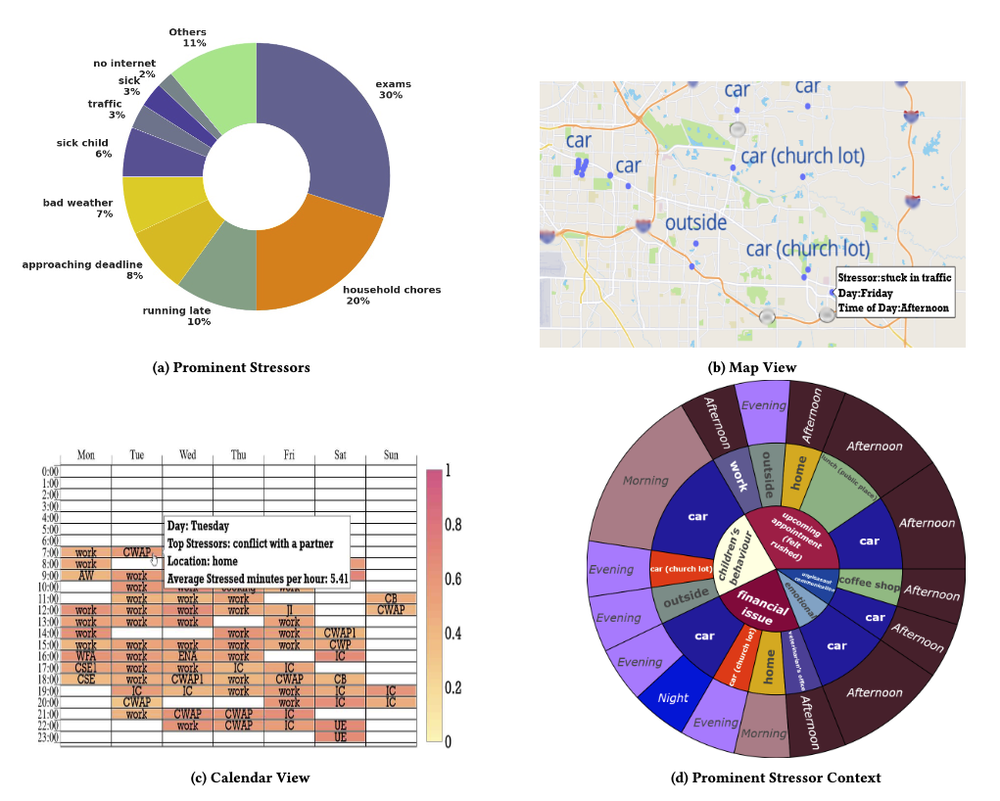

# **📊 Personal Informatics System for MOODS Study**  

## **📌 Overview**  
This repository contains the code for the **Personal Informatics System** developed for the **MOODS Study**. The system is designed to **automate stressor reflection and visualization**, helping participants gain insights into their **momentary stressors** using wearable technology.  

The system was presented in the paper:  
📄 **“Momentary Stressor Logging and Reflective Visualizations: Implications for Stress Management with Wearables”**  
📌 Published in **ACM CHI Conference on Human Factors in Computing Systems**.  
🔗 [Read the Paper](https://dl.acm.org/doi/10.1145/3613904.3642662)  

---

## **⚙️ System Functionality**  
The **Personal Informatics System** is fully automated and operates as follows:  
✅ **Data Extraction**  
- Automatically retrieves **stress-related data** from each user **for the past week**.  
- Processes raw data and applies **noise reduction techniques** to filter artifacts.  

✅ **Visualization Generation**  
- Generates **16 types of visualizations** to support **stress awareness & reflection**.  
- Designed to help users **identify patterns** in their stressor experiences.  

✅ **Automated Email Delivery**  
- Every **Sunday**, the system **automatically emails personalized visualizations** to users.  
- Ensures participants receive real-time insights without manual intervention.  

---

## **📊 Sample Visualizations**  
Here are examples of the stressor visualizations generated by the system:  

  
*Figure: Example of stressor reflection visualization*  

---

## **🚀 Key Features & Impact**  
🔹 **Fully automated workflow**—from data collection to visualization delivery.  
🔹 **Enhances stress awareness** through reflective personal informatics.  
🔹 **Supports wearable-integrated research** for behavioral stress interventions.  
🔹 **Scalable system**—can handle multiple users with minimal overhead.  

---

## **📌 Getting Started**  
To deploy the system or modify visualizations, refer to [`SETUP.md`](SETUP.md).  

For research inquiries, contributions, or collaborations, feel free to reach out:  

📧 **[Your Email]**  
🔗 **[GitHub Repo URL]**  

---

🚀 **This system bridges personal informatics, stress management, and automation for wearable-based behavioral interventions!**  